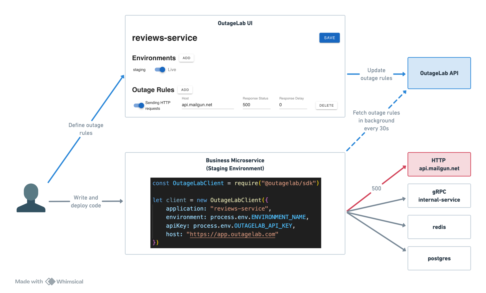

# What is OutageLab?

OutageLab provides a UI for remotely injecting failure into running services. You describe how you want an application's HTTP dependencies to fail, and OutageLab makes it happen within seconds, no code changes or redeployment necessary.

## How does it work?

OutageLab uses a basic client / server architecture.

The OutageLab server hosts the UI for configuring outage behaviors and an API allowing clients to fetch those configurations. You can choose from [managed hosting](https://app.outagelab.com), self hosting, or local hosting for the server.

Client libraries are installed in application code and are available for several programming languages (with more to come). The client library installs HTTP interceptors that are capable of mocking responses to simulate failure or artificially add latency. These behaviors are driven by the configurations defined by users in the UI, which are fetched by the client in a background worker that runs every 30 seconds.

## Is OutageLab easy to set up?

OutageLab aims to be the easiest tool of its kind for developers to get started with. Unlike most chaos testing tools, it has zero infrastructure-level requirements or setup. As long as you can install and import a library, you can use it - in the cloud, on-prem, serverless, anywhere.

The only pre-requisite to using OutageLab is choosing how to host the backend server. The easiest and recommended way to get started is to sign in to a free personal account at [app.outagelab.com](https://app.outagelab.com).

Check out the [5 minute quickstart guide](./quickstart/) to learn more.

## Am I ready for chaos testing? Isn't it risky?

OutageLab shouldn't be compared with high stakes tools like Netflix's Chaos Monkey, which built a reputation for its approach of intentionally killing servers at random in production. In contrast, OutageLab's primary focus is on-demand failure simulation in non-production environments.
